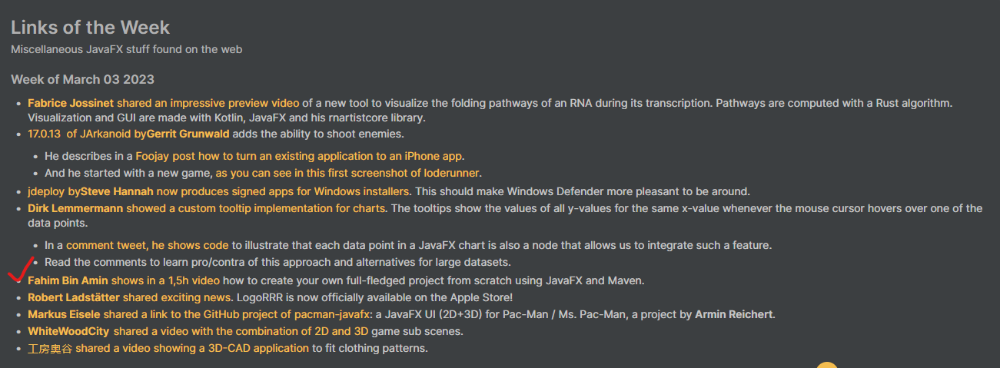

# 💎 Base Calculator

.png)

A BaseCalculator desktop application using JavaFX (Binary, Octal, Hexadecimal).

 

### 🥇 This project along with the step-by-step tutorial has been featured as "Links of the Week" on [JFX-Central](https://www.jfx-central.com/home).
 

 

## 📸 Screenshots of the project

.png)

A next page to show you how to link additional windows.

.png)

Conversion in action!

.png)

Print invalid input to show the user.

## ✒️ Backstory

I made this project for my Advanced Object Oriented Programming Lab at United International University. It was our first quiz day, and our faculty asked us to make this project. I managed to build the entire project from scratch within 16 minutes. But I have also created a long step by step tutorial video to show others how you can also make this type projects from scratch!

## 💻 Features

✅ Decimal to Binary  
✅ Decimal to Hexadecimal  
✅ Decimal to Octal  
✅ Next Screen button to go into additional pages  
✅ Clear the User Panel  
✅ Exit the program  

## 🔍 Main class
The main class is **MainLanding** class that is located within `src/main/java/com/calculator/basecalculator/MainLanding.java`.

## 🫴🏻 Contribution

Any kind of useful contribution is more than welcome! 🤗

## 👔 Usage

You can use this project, but make sure to **fork** it instead of cloning and pushing it to your repository.

## 📺 Video tutorial
[JavaFX Complete GUI Project: Base Calculator](https://youtu.be/KMpshYEIxFs)

## 🔖 Written step by step article

**Coming soon on freeCodeCamp**
